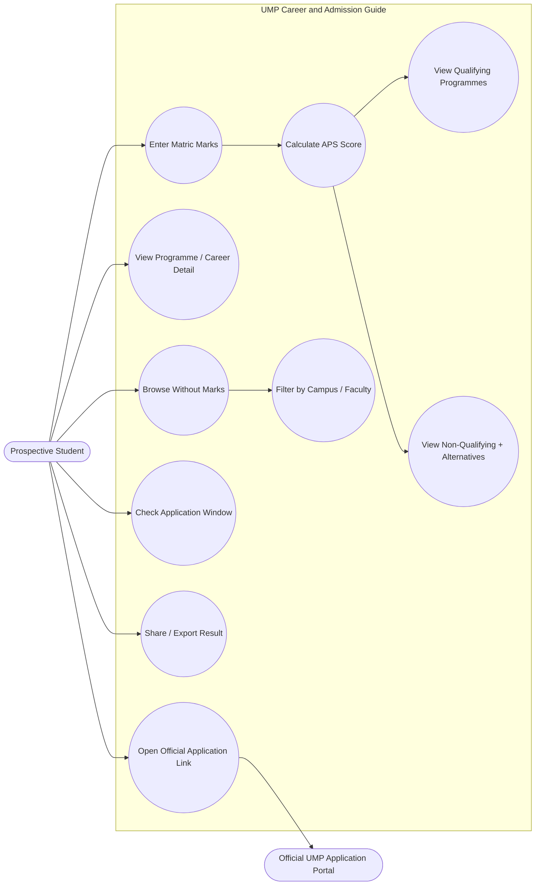
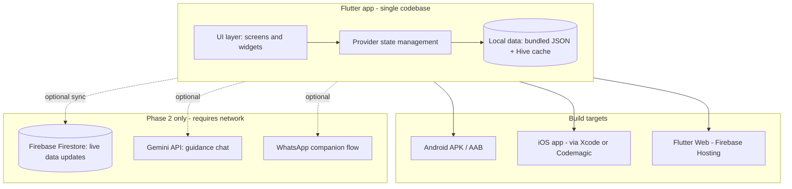

> **How to use this file:** Open Claude Code in a new, empty project folder and paste everything from the `# Build Brief` heading down as your first message. It is self-contained — the real APS formula, a worked example, seed data, and a prioritised MVP list are all included — so Claude Code shouldn't need to stop and ask basic questions before it starts building. Every judgment call (stack, state management, scope cuts) has already been made and stated as an assumption; edit a section first if you want to change one.
>
> This replaces `UMP_CAREER_AND_ADMISSION_GUIDE.pptx` (the original Android-only "Project Plan" deck). Nothing from the original brief is dropped — it's carried forward and extended. See the comparison table below.

---

# Build Brief: UMP Career and Admission Guide

## Mission

Build a real, working, cross-platform application (**Web + Android + iOS, one Flutter codebase**) that lets a prospective University of Mpumalanga (UMP) student enter their Grade 11/12 marks and, in under two minutes, see exactly which UMP programmes they currently qualify for, which they don't (yet) and what to do about that, without needing a data bundle, a login, or a school counsellor to interpret it for them.

This is not a cosmetic redo of the original slide deck. The original was a plan for a bare APS-calculator-and-course-list Android app. This brief turns it into a decision-support tool aimed at a real, documented gap — detailed below — while keeping every requirement from the original brief intact.

## Why this redo, and not just a straight port

Research done before writing this brief:

- UMP's own applicant system (the iEnabler portal) is transactional — it lets you fill in and submit an application, but it assumes you already know which two programmes to choose. It has no built-in APS check, no course-matching, and no guidance layer.
- South Africa's Department of Higher Education runs a national career-advice service (**Khetha** / National Career Advice Portal) via phone, SMS and radio — but it is generic across all institutions and careers, not UMP-specific, and not app-based.
- Statistics South Africa data (cited via academic and industry sources) puts household internet access at roughly **10% in rural areas versus 66% in urban areas**, and affordability of data — not just devices — is repeatedly identified as a primary barrier for first-year students from rural backgrounds, including specifically in Limpopo studies. Most existing "APS calculator" tools are ordinary data-hungry websites built by bursary-aggregator blogs, not the university, and none of them are offline-capable.
- Android holds roughly 83–84% of the South African smartphone market versus ~16% iOS — which is why "single Flutter codebase, Android-first quality bar, iOS and Web as first-class outputs of the same code" is the right architecture, not three separate builds.
- UMP's 2027 application window is **open right now** (opened 1 June 2026, undergraduate closing 30 November 2026) — so this tool is not a hypothetical class exercise, it is immediately usable by real applicants today.

| Original Project Plan | This Redo |
|---|---|
| Android only, XML layouts | Web + Android + iOS from one Flutter codebase |
| Generic/placeholder course data | Real UMP APS formula, real programmes, both real campuses, sourced and dated |
| "Qualify / don't qualify" dead end | Non-qualifying result suggests the nearest real alternative pathway (e.g. a Diploma or Higher Certificate that leads to the same field) |
| No stated connectivity assumption | Built offline-first, deliberately, because most of the target users are on limited data |
| No mention of who is *not* being reached | Explicitly designed around SA's urban/rural digital divide and UMP's own two-campus, multilingual context |
| Static "application dates" text | Live application-window banner driven by a config date, not hardcoded copy that goes stale |

## Users and Platforms

**Primary user:** a Grade 11 or 12 learner in Mpumalanga/Limpopo (or anywhere in South Africa) considering UMP, often on a mid/low-range Android phone with limited data, sometimes sharing a device.

**Secondary users:** their parent/guardian or teacher (may view a shared result), and UMP's own admissions/marketing staff as an informal reference tool.

**Platforms — all three, from one Flutter codebase:**
1. **Android** — primary target, build and test against this first (APK + AAB).
2. **Web** — responsive, deployed as a static build (Firebase Hosting is a good default — free tier, and consistent with the Firebase usage in this developer's other projects). This is also the fallback distribution channel for iOS users on day one (see iOS note below).
3. **iOS** — build the Flutter project with a correct, clean `ios/` target from day one (proper `Info.plist`, permissions, app icons, no Android-only plugins). **Important constraint to state plainly:** compiling a signed `.ipa` requires Xcode on macOS, or a cloud Mac CI (e.g. Codemagic's free tier). If this is being built on a Windows machine tonight, do not promise a literal installable iOS binary by the deadline — ship the Web build as an "Add to Home Screen" installable app on iOS Safari as the same-day iOS deliverable, and keep the `ios/` project genuinely buildable the moment Mac/Xcode access exists. Say this explicitly in the README rather than silently skipping iOS.

## Scope — MVP (build this first, in this order)

Everything below must work **fully offline** after the first load. No login, no account, no server round-trip required for any of it.

1. **Home screen** — one-line pitch, a live "Applications for 2027 are open — closes in N days" banner (calculated from a config date, not hardcoded text), primary CTA into the calculator, secondary link to Explore.
2. **APS Calculator** — a form for the 7 prescribed NSC subjects: Home Language, First Additional Language, Mathematics *or* Mathematical Literacy (toggle, not both), Life Orientation, and 3 elective subjects (searchable dropdown of standard NSC subjects). Accept a percentage mark per subject; derive the NSC achievement level automatically (table below). Validate: no empty fields, no marks outside 0–100, Maths/Maths Lit is mutually exclusive.
3. **APS calculation engine** — implement UMP's actual formula (below), with the worked example as a unit test. This is the core of the app; get it right before anything else.
4. **Results screen** — total APS score with a visible breakdown (which subject contributed what), then two clearly separated lists:
   - **Programmes you qualify for** (APS met and subject-level minimums met), grouped by faculty, showing campus.
   - **Programmes you don't qualify for yet** — for each, if there's a related lower-APS pathway in the seed data (e.g. a Diploma or Higher Certificate in the same field), show it as "Consider this instead" rather than just a red X. This is the single most important differentiator versus the original plan — do not skip it.
5. **Course/Career detail screen** — per programme: description, faculty/school, campus, APS + subject requirements, and a clearly-labelled outbound link to that programme's real UMP page.
6. **Explore/Browse screen** — the full seeded programme catalogue, filterable by faculty and by campus, usable *without* entering marks first (for a Grade 10/11 learner who isn't ready to calculate yet).
7. **Apply CTA** — an outbound link to the official UMP online application portal. Do not build any in-app application form, account, or login — that's explicitly out of scope (see below) and duplicates UMP's own system.
8. **About/Info screen** — both campus addresses, general enquiries contact, a "data last verified" date, and a visible disclaimer that this is an independent student project, not an official University of Mpumalanga product, with a pointer to ump.ac.za for anything binding.
9. **Share/export** — from the Results screen, let the user export their result as a shareable image or text summary (e.g. to send to a parent or teacher over WhatsApp). No account or backend needed — this is a local share-sheet action.

## Scope — Phase 2 / stretch (only after everything above is solid and working)

Build these only if MVP is fully working and there's time left. Do not let any of these delay the MVP.

- **Short interest quiz** (5–8 questions) that suggests a starting faculty/school before the learner even opens the calculator.
- **Campus-aware nudges**: since Siyabuswa campus is Education-only (Foundation Phase Teaching) and everything else sits at Mbombela, surface that distinction clearly wherever campus matters.
- **Multilingual UI**: structure all UI strings through Flutter's `.arb`/`intl` localization from the start (even if only English ships in the MVP) so adding isiSwati, Xitsonga, Sepedi or isiNdebele later is a translation task, not a rebuild. Worth doing given UMP's own active push on South African-language instruction.
- **Gemini-powered guidance chat**: a lightweight assistant that explains *why* a programme was or wasn't matched, using the same Gemini API pattern already used in this developer's other projects (QuestKids, UCAG) — network-required, so it must degrade gracefully to "unavailable offline" rather than blocking the core flow.
- **WhatsApp companion flow**: given WhatsApp's near-universal reach in South Africa (an estimated ~29 million users, ~94% of SA internet users) and its very low data footprint compared to a full app, a simple flow where a learner can message their marks to a WhatsApp number and get their APS + top matches back as text — this reaches people who can't or won't download an app at all. Treat as a genuinely separate, optional workstream.
- **Firebase Firestore sync** for the course dataset, so updates to APS thresholds/dates don't require a new app release — MVP data lives in a bundled local JSON/config file specifically so this can be layered on without a rearchitecture.

## Explicit exclusions (carried over from the original brief — do not build these)

- No NSFAS/bursary information or integration.
- No support for any university other than UMP.
- No user accounts, login, sign-up, or password of any kind.
- No in-app submission of an actual UMP application — always hand off to the official portal.

## Non-Functional Requirements

- **Offline-first**: the calculator, matching logic and full seed dataset must work with the device in airplane mode after first install/load. This is not optional — it is the point of the project.
- **Low-end-device performance**: target smooth operation on a 2GB-RAM-class Android phone; keep the bundle and image assets light.
- **Responsive**: phone, tablet, and desktop-web breakpoints, not just one fixed layout stretched.
- **Accessible**: sufficient colour contrast, scalable text, semantic labels for screen readers.
- **Fast**: the core "enter marks → see results" path should feel instant — no network spinners on the critical path.
- **No PII leaves the device** in the MVP — there's nothing to secure server-side because there's no server-side; still validate all input defensively.
- **Honest branding**: visible footer/about disclaimer that this is an independent student project and not an official UMP system, with a link to ump.ac.za.
- Supersedes the original plan's "compatible with Android devices" line — now Android + iOS + modern evergreen web browsers.

## UMP Real Data Pack

Use this as the actual seed data. It was gathered directly from ump.ac.za and cross-checked against several independent admissions-aggregator sites; where a figure could only be confirmed from a secondary source, it's flagged. Treat this whole section as **"last verified July 2026 — reconfirm against the current UMP prospectus before final submission,"** since APS thresholds can be revised year to year.

### APS formula (UMP-specific — do not use a generic 6-subject formula)

UMP uses **all 7 prescribed NSC subjects**, not 6. Life Orientation is included, but its contribution is **halved**.

**Achievement level table (standard NSC scale):**

| Level | % Range | Points |
|---|---|---|
| 7 | 80–100 | 7 |
| 6 | 70–79 | 6 |
| 5 | 60–69 | 5 |
| 4 | 50–59 | 4 |
| 3 | 40–49 | 3 |
| 2 | 30–39 | 2 |
| 1 | 0–29 | 1 |

**Formula:** `APS = level(Home Language) + level(First Additional Language) + level(Maths OR Maths Literacy) + level(Elective 1) + level(Elective 2) + level(Elective 3) + (level(Life Orientation) / 2)`

**Worked example — use this as a unit test:**

| Subject | Mark | Level | Points counted |
|---|---|---|---|
| English Home Language | 65% | 6 | 6 |
| Sepedi First Additional Language | 55% | 4 | 4 |
| Mathematics | 45% | 3 | 3 |
| Life Sciences | 58% | 4 | 4 |
| Geography | 62% | 5 | 5 |
| Physical Sciences | 50% | 4 | 4 |
| Life Orientation | 70% | 6 | 3 (halved) |
| **Total APS** | | | **29** |

Implementation note: if the halved Life Orientation level is odd (e.g. Level 5 → 2.5), keep the fractional value through the sum and only round the **final** total — don't round intermediate steps. Flag this as a specific test case, and note in the README that it should be sanity-checked against UMP's own online calculator if one becomes available.

### Campuses

| Campus | Address | Hosts |
|---|---|---|
| Mbombela (main) | Cnr R40 and D725 Roads, Mbombela, 1200 | Agriculture & Natural Sciences faculty, Economics/Development/Business Sciences faculty (includes ICT, Hospitality, Development Studies, Social Sciences) |
| Siyabuswa | Bheki Mfundo Drive, Siyabuswa | Education faculty only (Foundation Phase Teaching) |

General enquiries: +27 (0)13 002 0001 · info@ump.ac.za

### Faculties and Schools (3 faculties, 8 schools total)

- **Faculty of Agriculture and Natural Sciences** — School of Agricultural Sciences, School of Computing and Mathematical Sciences, School of Biology and Environmental Sciences, School of Chemical and Physical Sciences.
- **Faculty of Education** — Foundation Phase Teaching (Siyabuswa only).
- **Faculty of Economics, Development and Business Sciences** — School of Social Sciences, School of Development Studies, School of Hospitality and Tourism Management.

### Seed programme dataset (real, sourced — extend later without restructuring the data model)

| Programme | Faculty / School | Campus | Min APS | Key subject requirements | Confidence |
|---|---|---|---|---|---|
| Diploma in ICT in Applications Development | Agriculture & Natural Sciences / Computing & Mathematical Sciences | Mbombela | 24 | English L4, Maths L3 (or Technical Maths) OR Maths Lit L6 | Confirmed, ump.ac.za |
| Bachelor of Science (BSc) | Agriculture & Natural Sciences / Biology & Environmental Sciences | Mbombela | 30 | English L4, Maths L4 or Maths Lit L6, plus L4 in 2 of {Life Science, Physical Science, Geography} | Confirmed, ump.ac.za |
| Diploma in Agriculture | Agriculture & Natural Sciences / Agricultural Sciences | Mbombela | 25 (with Maths) / 26 (with Maths Lit) | English L4, Maths L3 or Maths Lit L4, Agriculture L4 | Confirmed, ump.ac.za |
| Bachelor of Education in Foundation Phase Teaching | Education | Siyabuswa | 26 (with Maths) / 27 (with Maths Lit) | English L4, Maths L2, Maths Lit L3 | Confirmed, ump.ac.za |
| Bachelor of Administration | Economics, Development & Business Sciences / Development Studies | Mbombela | 32 | Maths L2 | Confirmed, ump.ac.za |
| Bachelor of Laws (LLB) | Economics, Development & Business Sciences / Development Studies | Mbombela | 33 | English L4, additional language L4, Maths L3 or Maths Lit L4 | Confirmed, ump.ac.za |
| Bachelor of Arts (Social Sciences stream) | Economics, Development & Business Sciences / Social Sciences | Mbombela | 30 | English L4, Maths L2 or Maths Lit L3 | Confirmed, ump.ac.za (exact programme title to double-check) |
| Diploma in Nature Conservation | Agriculture & Natural Sciences / Biology & Environmental Sciences | Mbombela | 27 | Life Science L4 | Secondary source (2027 prospectus summary) — verify |
| Diploma in Accounting | Economics, Development & Business Sciences | Mbombela | 30 | Maths L3 or Maths Lit L4 | Secondary source (2027 prospectus summary) — verify |
| Higher Certificate in ICT in User Support | Agriculture & Natural Sciences / Computing & Mathematical Sciences | Mbombela **and** Siyabuswa | Not yet confirmed — mark "TBC, confirm from current prospectus" | English L4 minimum expected | Unconfirmed — do not invent a number |

General baseline (applies before any programme-specific minimum): NSC with a Bachelor's or Diploma pass as required by the programme, and at least Level 4 (50–59%) in a minimum of four 20-credit subjects.

### 2027 application cycle (live right now)

- Opened: 1 June 2026.
- Closes: 30 November 2026 for undergraduate, advanced diploma and postgraduate diploma programmes; 30 January 2027 for Master's and Doctoral.
- Applicants may select up to **two** programme choices.
- Applications go through UMP's own online portal — this app links out to it, it never replaces it.

Store the open/close dates as a single config value the home-screen banner reads from, not as copy scattered through the UI, so updating it next year is a one-line change.

## Technical Architecture

- **Framework:** Flutter (single codebase → Android, iOS, Web). This is the right call given ~84% Android / ~16% iOS share in South Africa, the explicit request for Web + mobile + iOS, and consistency with this developer's existing Flutter/Firebase projects.
- **State management:** Provider — same pattern already used in this developer's other Flutter work (QuestKids), so there's nothing new to debug under time pressure.
- **Local data:** bundle the seed dataset as a local JSON asset; parse into simple Dart models at startup. Use `Hive` or `SharedPreferences` only for lightweight local state (last result, language choice) — not as a database that needs migrations.
- **No backend required for MVP.** Firestore is an explicit, clearly-separated Phase 2 addition — do not couple the MVP's core logic to it.
- **Folder structure (suggested):**
```
lib/
  main.dart
  models/            # Programme, Subject, ApsResult
  data/              # bundled seed dataset (json) + loader
  logic/             # ApsCalculator, CourseMatcher, ApplicationWindow
  screens/           # home, calculator, results, detail, explore, about
  widgets/           # shared UI components
  state/             # Provider ChangeNotifiers
  l10n/              # .arb strings, English shipped, others stubbed for Phase 2
assets/
  data/programmes.json
test/
  aps_calculator_test.dart   # must include the worked example above
```
- **Build targets:**
  - `flutter build apk` / `appbundle` — Android, buildable on any OS including Windows.
  - `flutter build web` — deployable to Firebase Hosting, also the same-day iOS delivery path via Safari "Add to Home Screen."
  - `ios/` project present and correctly configured, buildable via Xcode/macOS or Codemagic when available — do not skip creating this just because it can't be compiled tonight.

## Information Architecture





## Documentation to generate alongside the code

This started life as an academic project plan, so produce a `docs/` folder that can double as the write-up, mirroring and expanding the original deck's structure:

1. `README.md` — what the app is, the problem statement above, how to run each build target, current known limitations (esp. the iOS build caveat).
2. `docs/01-introduction.md`
3. `docs/02-objectives.md`
4. `docs/03-scope.md` — included/excluded, matching this brief exactly.
5. `docs/04-requirements.md` — functional and non-functional, as above.
6. `docs/05-architecture.md` — include both Mermaid diagrams.
7. `docs/06-risks.md` — risk register below.
8. `docs/07-data-sources.md` — the UMP Real Data Pack above, with the "last verified" date and the note about reconfirming before submission.

## Risk Register

| Risk | Mitigation |
|---|---|
| Incorrect APS calculation | Unit test against the worked example; add edge cases (Maths vs Maths Lit not chosen, odd-numbered LO level, missing subject) |
| Invalid/incomplete input crashes the app | Defensive input validation, inline error states, no unhandled exceptions |
| Cross-platform rendering inconsistencies | Stick to stable, well-supported Flutter packages only; test at least one device per platform class before calling it done |
| iOS can't be compiled tonight without a Mac | Ship Web build as the same-day iOS path (Add to Home Screen); keep `ios/` project genuinely buildable for later |
| Same-day deadline | Strict MVP-first build order (above); do not start Phase 2 items until MVP is fully working |
| Course/APS data goes stale | All figures live in one seed file with a visible "last verified" date, not scattered through UI strings |
| Users on low-end devices / limited data | Offline-first by design; lightweight assets; no auto-loading media |

## Acceptance Criteria / Definition of Done (MVP)

- [ ] App builds and runs on Android, on Web, and the iOS project builds cleanly with Xcode (even if not signed tonight).
- [ ] APS calculator produces the correct result for the worked example (29) and at least 3 additional test cases, covered by automated tests.
- [ ] Results screen clearly separates qualifying vs non-qualifying programmes, and every non-qualifying entry that has a real alternative in the seed data shows it.
- [ ] Full core flow (home → calculator → results → detail) works with the device in airplane mode.
- [ ] Explore screen lets a user browse the seed dataset without entering any marks.
- [ ] Home screen banner correctly reflects the live application window from the config date.
- [ ] "Apply now" opens the real UMP application portal in an external browser; no in-app account/login exists anywhere.
- [ ] About screen shows both campuses, contact details, data-last-verified date, and the independent-project disclaimer.
- [ ] `docs/` folder and `README.md` exist and are complete.
- [ ] No placeholder/lorem-ipsum content anywhere in the shipped build.

## Operating instructions for Claude Code

- Work through the MVP list in the order given. Don't start Phase 2 items until every MVP acceptance criterion above is checked off.
- This brief is intentionally complete so you can proceed without stopping to ask questions. If you hit a genuine blocker not covered here, state your best assumption, note it clearly in the README, and keep building rather than pausing.
- Do not invent APS figures or programme data beyond what's in the Real Data Pack above — where a figure is marked unconfirmed, keep it marked that way in the UI/data rather than filling in a guess.
- Prioritise a working, testable MVP on real device classes over polish. Ship something complete before making anything beautiful.

## Sources consulted (verify before final submission — APS rules and dates can change year to year)

- https://www.ump.ac.za/Study-with-us/Application-Process/Online-Applications
- https://www.ump.ac.za/Study-with-us/Faculties-and-Schools.aspx
- https://www.ump.ac.za/programmes_undergraduate_qualifications.html
- https://www.ump.ac.za/Study-with-us/Faculties-and-Schools/Faculty-of-Education/School-of-Early-Childhood-Education/Bachelor-of-Education-in-Foundation-Phase-Teaching.aspx
- https://www.ump.ac.za/Study-with-us/Faculties-and-Schools/Faculty-of-Economics,-Development-and-Business-Sci/School-of-Development-Studies/Bachelor-of-Administration.aspx
- https://www.ump.ac.za/Study-with-us/Faculties-and-Schools/Faculty-of-Economics,-Development-and-Business-Sci/School-of-Development-Studies/Bachelor-of-Laws.aspx
- https://www.ump.ac.za/Study-with-us/Faculties-and-Schools/Faculty-of-Agriculture-and-Natural-Sciences/School-of-Biology-and-Environmental-Sciences/Bachelor-of-Science-Degree.aspx
- https://www.ump.ac.za/Study-with-us/Faculties-and-Schools/Faculty-of-Agriculture-and-Natural-Sciences/School-of-Computing-and-Mathematical-Sciences/Diploma-in-ICT-in-Applications-Development.aspx
- https://www.studentroom.co.za/university-of-mpumalanga-ump-aps-requirements-explained-for-2027/
- https://schoolhive.co.za/university-of-mpumalanga-ump-prospectus/
- https://sajim.co.za/index.php/sajim/article/view/1344/2014 (digital divide, first-year rural students)
- https://invigilator.app/en/what-sa-s-education-statistics-reveal-about-learning-realities/ (Stats SA rural/urban internet access figures)
- https://www.careerhelp.org.za/ (Khetha / National Career Advice Portal)
